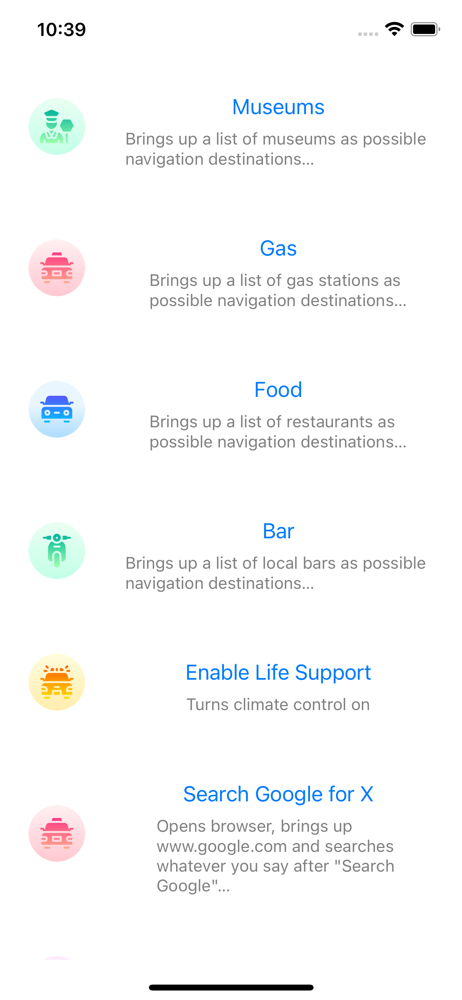

# Voice Command React Native Mobile App 

A simple and user-friendly React Native mobile app that allows users to access voice commands with just a tap. The app uses the device's text-to-speech (TTS) feature to read out the commands. The user interface is designed to be easy to use, with a list of commands displayed in a flat list. Use phone speaker to emit Tesla voice commands.

## Key Features
- Access voice commands with a single tap
- Uses the device's text-to-speech (TTS) feature to read out the commands
- Simple and user-friendly design

## How to Use
To use the Voice Command React Native Mobile App, simply tap on the command you want to use. The app will then use the device's TTS feature to read out the command. 

## Technologies Used
- React Native
- React
- Text-to-Speech (TTS)
- React Native Modules

## Conclusion
Voice Command React Native Mobile App is a simple and user-friendly app that allows users to access voice commands with just a tap. It is an ideal app for people who want to quickly access voice commands without having to type them out. Try it out today!

